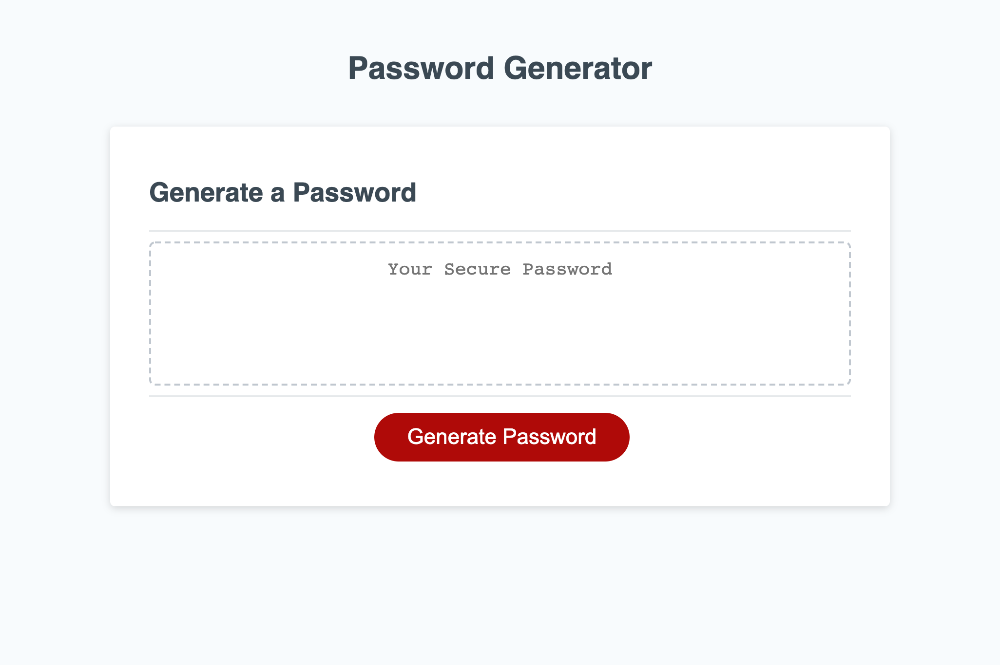

# hw3-password-generator

## Description

A password generator that accepts inputs from the user and uses those inputs to generate a password tailored to the users choices. CLicking the button will begin a series of prompts to determine the passoword's criteria. The user will choose whether to incluse lower case letters, upper case letters, numbers, and/or special characters, as well as the length of the password within the limits of 8 to 128 characters. The password will be checked to ensure at least one optional character type is chosen by the user, and that the chosen length is within the limit. A password is generated to meet the chosen criteria and then displayed to the screen in the text area.

## Screenshot

## Links to Application

-   Here is the repo: [RedComet6/hw1-b](https://github.com/RedComet6/hw3-password-generator)
-   Here is the pages: [RedComet6 hw1-b Pages](https://redcomet6.github.io/hw3-password-generator/)
